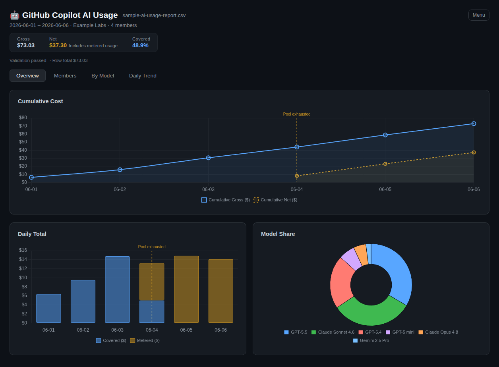

# 🤖 GitHub Copilot AI Usage Viewer

A browser-based visualizer for the GitHub Copilot AI Usage Report CSV.
Drop in your billing export to explore spending by org, member, model, and day.

CSV data is processed in your browser and is not uploaded.



**Use in browser:** https://daichiueura.github.io/copilot-ai-usage-viewer/ ([Demo](https://daichiueura.github.io/copilot-ai-usage-viewer/?csv=assets/sample-ai-usage-report.csv))

## Usage

1. Go to **GitHub → Billing → AI usage → Get usage report** and download the CSV.
2. Open `index.html` in your browser.
3. Drop the CSV onto the page.

### Open a CSV from URL

Use `csv=` to load a CSV by URL. Relative URLs work when the CSV is hosted on the same site:

```text
https://daichiueura.github.io/copilot-ai-usage-viewer/?csv=reports/ai-usage-report.csv&tab=overview
```

External URLs are supported when the CSV server allows cross-origin requests:

```text
https://daichiueura.github.io/copilot-ai-usage-viewer/?csv=https://example.com/ai-usage-report.csv&tab=overview
```

The resolved URL must be HTTP(S), and CSV files are limited to 10 MB.

## Views

- **Overview** — cumulative spend, daily total, model share; metered billing overlay when applicable
- **Members** — per-member bar chart and sortable detail table
- **By Model** — stacked usage by member and model
- **Daily Trend** — day-by-day usage for top members

## Interpretation modes

The viewer supports two usage bases and a comparison view:

- **Actual consumption** — prefers AI credit-specific fields such as `aic_quantity` and `aic_gross_amount`
- **GitHub UI compatible** — uses standard billing fields such as `quantity` and `gross_amount`
- **Compare** — shows where those two interpretations diverge

For the CSV interpretation policy used by this viewer, see [docs/csv-interpretation-policy.md](docs/csv-interpretation-policy.md).

Supports EN / 日本語. Validates the CSV format on load.

## Testing

This repo includes minimal Playwright smoke tests that open `index.html` directly and load the bundled sample CSV.

```bash
npm install
npx playwright install-deps chromium
npx playwright install chromium
npm run test:e2e
```
