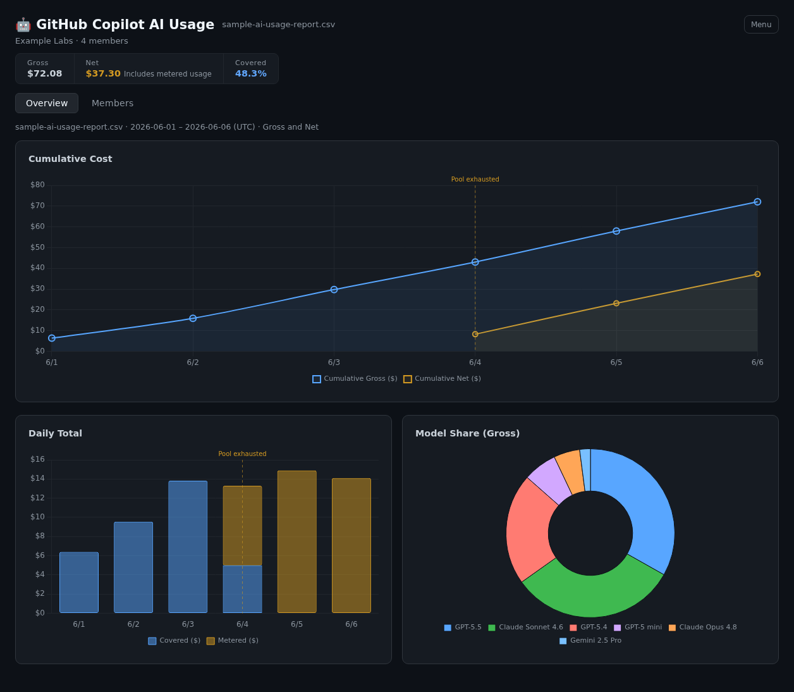

# 🤖 GitHub Copilot AI Usage Viewer

A browser-based visualizer for the GitHub Copilot AI Usage Report CSV.
Drop in your billing export to explore spending by org, member, model, and day.

CSV data is processed in your browser and is not uploaded.



**Use in browser:** https://daichiueura.github.io/copilot-ai-usage-viewer/ ([Demo](https://daichiueura.github.io/copilot-ai-usage-viewer/?csv=assets/sample-ai-usage-report.csv))

## Usage

1. Go to **GitHub → Billing → AI usage → Get usage report** and download the CSV.
2. Open `index.html` in your browser.
3. Drop the CSV onto the page.

### Open a CSV from URL

Use `csv=` to load a CSV by URL. Relative URLs work when the CSV is hosted on the same site:

```text
https://daichiueura.github.io/copilot-ai-usage-viewer/?csv=reports/ai-usage-report.csv&tab=overview
```

External URLs are supported when the CSV server allows cross-origin requests:

```text
https://daichiueura.github.io/copilot-ai-usage-viewer/?csv=https://example.com/ai-usage-report.csv&tab=overview
```

The resolved URL must be HTTP(S), and CSV files are limited to 10 MB.

### Mark a usage limit

Use `net_limit=` to draw a horizontal reference line on the Overview cumulative
chart, against the cumulative Net (metered) line. The value is supplied here, not
read from the CSV. With no `net_limit`, nothing is drawn.

```text
https://daichiueura.github.io/copilot-ai-usage-viewer/?csv=reports/ai-usage-report.csv&net_limit=10000
```

## Views

- **Overview** — cumulative spend, daily total, model share; metered billing overlay when applicable
- **Members** — per-member bar chart and sortable detail table
- **By Model** — stacked usage by member and model
- **Daily Trend** — day-by-day usage for top members

When a CSV has no per-member breakdown (a single org-level entity), the viewer
shows the Overview only and hides the per-member tabs, noting why.

## How usage is interpreted

The viewer aggregates usage from the standard billing columns (`gross_amount` /
`net_amount` / `quantity`). The `aic_quantity` / `aic_gross_amount` preview columns
were [deprecated and zeroed by GitHub on 2026-06-01](https://github.blog/changelog/2026-06-11-ai-usage-report-updates/),
so they are ignored.

For the CSV interpretation policy used by this viewer, see [docs/csv-interpretation-policy.md](docs/csv-interpretation-policy.md).

Supports EN / 日本語. Validates the CSV format on load.

## Automation (optional)

GitHub only shows AI credit usage to billing admins. To share it with people who can't see it
in the GitHub UI, the [automation/](automation/) folder has small, dependency-free Node scripts
that rebuild the data from the API and write CSVs this viewer can open. There are two recipes:

- **Organization totals** — gross and net from the
  [AI credit usage report API](https://docs.github.com/en/rest/billing/usage). No per-member
  rows, so the result is safe to publish to non-admins.
- **Per-user consumption** — how much each member consumed, day by day, from the Copilot usage
  metrics reports. Gross only: no API attributes net to an individual member, so those columns
  are left empty rather than estimated.

Run them on demand or on a schedule (e.g. GitHub Actions), then host the CSV for your team.
See [automation/README.md](automation/README.md) for the scripts, tokens, and what each CSV
does and does not carry.

## Testing

Two suites: viewer e2e (Playwright drives `index.html` and loads CSV fixtures) and
automation unit tests (`node --test`, covering the companion scripts). `npm test` runs both.

```bash
npm install
npx playwright install-deps chromium
npx playwright install chromium
npm test          # or: npm run test:e2e  /  npm run test:unit
```
