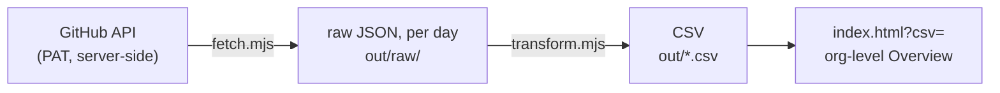

# Companion recipe — build the org-level Overview CSV from the API

GitHub's **AI usage** page (under Billing) shows an organization's AI credit usage, but only
billing admins can open it. Its "Get usage report" button exports a CSV with a per-member
breakdown — a manual, admin-only download, not something to re-share on a schedule or with a
wide audience.

These two small Node scripts pull **organization totals** from the
[AI credit usage report API](https://docs.github.com/en/rest/billing/usage) and write a CSV
the viewer renders as an org-level Overview. The API returns org totals only (no per-member
rows), so the result is safe to publish to non-admins — and a scheduled job keeps it current
without anyone re-exporting by hand.



## Scripts

Two dependency-free Node scripts, run in order:

- **`fetch.mjs`** — read the organization's daily AI credit usage and save the raw JSON.
  Never prints the token or response body; only `YYYY-MM-DD: 200 OK (N items)`.
  - env: `AI_USAGE_PAT`, `ORG` (required); `YEAR`, `MONTH` (optional backfill); `RAW_DIR`.
  - range: the month that yesterday (UTC) belongs to, days 1..yesterday (so the 1st of a
    month shows the just-completed previous month). Output: `RAW_DIR/*.json` (default `./out/raw`).
- **`transform.mjs`** — convert the raw JSON into one CSV with the **same schema as the
  manual GitHub export** (minus the deprecated `aic_*` columns). No token needed.
  - env: `RAW_DIR` (default `./out/raw`), `OUT_CSV`. `organization` comes from
    the JSON; `username` is a constant `(org total)` (the API has no per-user dimension);
    amounts are written at full precision so totals match the API exactly.

```bash
cd automation
# .env (gitignored): AI_USAGE_PAT=...  ORG=...
node --env-file=.env scripts/fetch.mjs   # -> out/raw/*.json
node scripts/transform.mjs               # -> out/ai-credit-usage.csv
```

The required token is a fine-grained PAT with **Organization Administration: read**.

`transform.mjs` has tests in `tests/` (raw JSON fixtures + the mapping), run from the repo
root with `npm run test:unit` (`node --test`, no token needed). `fetch.mjs` talks to the
live API, so it is not unit-tested — check it by running it against your org.

## Viewer behavior (org-level auto-detection)

The viewer (`../index.html`) is data-driven: when a CSV has a single distinct
`username` (no per-member breakdown), it hides the per-member tabs (Members / By Model /
Daily Trend), shows an Information note, and renders the Overview only. So the CSV from
this recipe just works via `?csv=` — no special flag.

## Getting the CSV to viewers

The CSV has **no per-user data** (org totals by date and model), so it is safe to share
widely. Two ways to get it in front of people:

1. **Hand them the file** (any plan, no infra) — run the two scripts and share the CSV:
   drop it onto the viewer (`index.html`), or put it wherever your team looks. A scheduled
   GitHub Actions job can produce the CSV as a downloadable artifact instead of you running
   it by hand.
2. **Host a page they can open** — serve `index.html` + the CSV from the same origin and
   share `index.html?csv=./data.csv` (same-origin avoids CORS). Any static host works (S3,
   an internal server, GitHub Pages). On **GitHub Enterprise Cloud**, a member-restricted
   **private GitHub Pages** site lets non-admins with repo read access self-serve the
   always-current Overview. Keep the data repo private — `workflows/update-overview.yml` is
   a ready-to-copy daily template for exactly this.

## Deploying with the workflow (GitHub Pages)

`workflows/update-overview.yml` builds the CSV and deploys the viewer to GitHub Pages on a
daily schedule. To use it, create a **private** repository — putting it in the target org
lets `ORG` default to the repo owner — containing:

- `index.html` (the viewer)
- `automation/scripts/fetch.mjs` and `automation/scripts/transform.mjs`
- `.github/workflows/update-overview.yml` (copied from this template)

Then:

1. **Secret** — Settings → Secrets and variables → Actions → `AI_USAGE_PAT` = a fine-grained
   PAT with Organization Administration: read.
2. **Variable** (optional) — `ORG` = the org login. Skip it when the repo lives in the target
   org; set it only to target a different org.
3. **Pages** — Settings → Pages → Source = "GitHub Actions". Set visibility to Private to
   restrict access to members with repo read.
4. **Default branch** — Actions only runs a workflow from the repository's default branch, so
   push these files to it (e.g. `main`).
5. Trigger it from the Actions tab (or wait for the schedule), then share
   `<pages-url>/index.html?csv=./data/ai-credit-usage.csv`.

## Privacy

Never commit real exports or tokens (`out/` and `.env` are gitignored). The token lives
only in CI secrets or a local `.env` and is never embedded in the viewer. For
member-restricted hosting, use a private repo.
