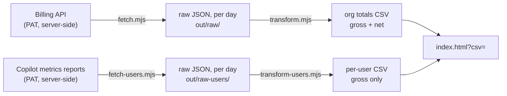

# Companion recipes — build viewer CSVs from the API

GitHub's **AI usage** page (under Billing) shows an organization's AI credit usage, but only
billing admins can open it. Its "Get usage report" button exports a CSV with a per-member
breakdown — a manual, admin-only download, not something to re-share on a schedule or with a
wide audience.

These dependency-free Node scripts rebuild that data from the API and write CSVs the viewer
opens. There are two recipes, and they answer different questions:

- **Organization totals** (`fetch.mjs` + `transform.mjs`) — what the org spent and what it is
  billed, gross and net. No per-member rows, so the result is safe to publish to non-admins.
- **Per-user consumption** (`fetch-users.mjs` + `transform-users.mjs`) — how much each member
  consumed, day by day. Gross only, and it names real people.

A scheduled job keeps either one current without anyone re-exporting by hand.


```mermaid
flowchart LR
    BILL["Billing API<br/>(PAT, server-side)"] -- fetch.mjs --> BRAW["raw JSON, per day<br/>out/raw/"]
    BRAW -- transform.mjs --> BCSV["org totals CSV<br/>gross + net"]
    MET["Copilot metrics reports<br/>(PAT, server-side)"] -- fetch-users.mjs --> URAW["raw JSON, per day<br/>out/raw-users/"]
    URAW -- transform-users.mjs --> UCSV["per-user CSV<br/>gross only"]
    BCSV --> VIEW["index.html?csv="]
    UCSV --> VIEW
```

Both recipes split the same way: the fetch script saves the API response as raw per-day JSON
and the transform script turns that into a CSV. Re-running a transform never calls the API.

## Organization totals

- **`fetch.mjs`** — read the organization's daily AI credit usage and save the raw JSON.
  Never prints the token or response body; only `YYYY-MM-DD: 200 OK (N items)`.
  - env: `AI_USAGE_PAT`, `ORG` (required); `YEAR`, `MONTH` (optional backfill); `RAW_DIR`.
  - range: the month that yesterday (UTC) belongs to, days 1..yesterday (so the 1st of a
    month shows the just-completed previous month). Output: `RAW_DIR/*.json` (default `./out/raw`).
- **`transform.mjs`** — convert the raw JSON into one CSV with the **same schema as the
  manual GitHub export** (minus the deprecated `aic_*` columns). No token needed.
  - env: `RAW_DIR` (default `./out/raw`), `OUT_CSV`. `organization` comes from
    the JSON; `username` is a constant `(org total)` (the API has no per-user dimension);
    amounts are written at full precision so totals match the API exactly.

```bash
cd automation
# .env (gitignored): AI_USAGE_PAT=...  ORG=...
node --env-file=.env scripts/fetch.mjs   # -> out/raw/*.json
node scripts/transform.mjs               # -> out/ai-credit-usage.csv
```

The required token is a fine-grained PAT with **Organization Administration: read**.

## Per-user consumption

- **`fetch-users.mjs`** — read the Copilot usage metrics reports and save the raw rows as
  per-day JSON. Never prints the token or the rows; only `YYYY-MM-DD: N rows`.
  - env: `AI_USAGE_PAT`, `ORG` (required); `USERS_RAW_DIR` (default `./out/raw-users`).
  - range: one call to `copilot/metrics/reports/users-28-day/latest` covers 28 days ending at
    the newest day the reports carry. Days of that month the window does not reach — up to
    three, at the end of a long month — are fetched one at a time from
    `copilot/metrics/reports/users-1-day`. Days from the previous month are saved too.
  - a day the reports have not generated yet answers `204`; the current day, and any day
    outside the one year the reports keep, answers `400`. Both are logged and skipped
    rather than failing the run.
- **`transform-users.mjs`** — convert those rows into one CSV with the same export schema, one
  row per member per day. No token needed.
  - env: `USERS_RAW_DIR` (default `./out/raw-users`), `ORG` (required, written to the
    `organization` column), `OUT_CSV`; `BILLING_RAW_DIR` (optional, see below).
  - scope: the month of the newest day present in `USERS_RAW_DIR`, from the 1st through that
    day. Early in a month, before the new month has any data, that is the previous month in
    full. Members who used no credits produce no row.

```bash
cd automation
node --env-file=.env scripts/fetch-users.mjs   # -> out/raw-users/*.json
ORG=your-org node scripts/transform-users.mjs  # -> out/ai-credit-usage-by-user.csv
```

The required token is a fine-grained PAT with the organization's
**View Organization Copilot Metrics** permission (a classic PAT with the `read:org` scope also
works) — a different permission from the billing recipe above, and the organization must have
the Copilot usage metrics policy enabled.

### What the per-user CSV carries

The metrics reports give one number per member per day: credits consumed. At $0.01 per credit
that is the same **gross** amount the billing API reports, so `quantity` and `gross_amount`
line up with the org totals CSV. Everything else the export schema has room for is left empty:

- **`net_amount` and `discount_amount` are blank.** Net is what the org is actually billed
  after the included AI credit pool is applied, and no API attributes that to a member. Blank
  means *not available* — it does not mean the usage was fully covered. Do not fill these in
  by prorating the org's discount.
- **`model` is `(all models)` and `sku` is `Copilot AI Credits`.** The credit figure already
  sums every model and SKU, and the reports carry no breakdown to split it by.
- **`total_monthly_quota`, `repository` and `cost_center_name` are blank** for the same reason.

The credit figure only exists from 2026-06-19, when GitHub
[added it to the reports](https://github.blog/changelog/2026-06-19-ai-credits-consumed-per-user-now-in-the-copilot-usage-metrics-api/).
It was not backfilled, so earlier days carry no credit field at all and produce no rows.

The reports lag a day or two behind, and the two feeds have independent timelines: their newest
day can differ, and their histories can start on different dates. Each CSV stands on its own —
neither is trimmed to match the other.

Setting `BILLING_RAW_DIR` to the org-totals raw directory turns on a cross-check: for each day
both feeds carry, the daily credit totals are compared and a difference over one credit is
logged. It is advisory and never fails the run.

## Tests

`transform.mjs` and `transform-users.mjs` have tests in `tests/` (raw JSON fixtures + the
mapping), run from the repo root with `npm run test:unit` (`node --test`, no token needed).
The fetch scripts talk to the live API, so they are not unit-tested — check them by running
them against your org.

## Viewer behavior (org-level auto-detection)

The viewer (`../index.html`) is data-driven: when a CSV has a single distinct
`username` (no per-member breakdown), it hides the per-member tabs (Members / By Model /
Daily Trend), shows an Information note, and renders the Overview only. So the CSV from
the org-totals recipe just works via `?csv=` — no special flag.

## Getting the CSV to viewers

The **org totals** CSV has no per-user data (totals by date and model), so it is safe to share
widely. The **per-user** CSV names real members, so give it the audience you would give the
manual export — keep it inside the org, on a member-restricted host. Two ways to get a CSV in
front of people:

1. **Hand them the file** (any plan, no infra) — run the two scripts and share the CSV:
   drop it onto the viewer (`index.html`), or put it wherever your team looks. A scheduled
   GitHub Actions job can produce the CSV as a downloadable artifact instead of you running
   it by hand.
2. **Host a page they can open** — serve `index.html` + the CSV from the same origin and
   share `index.html?csv=./data.csv` (same-origin avoids CORS). Any static host works (S3,
   an internal server, GitHub Pages). On **GitHub Enterprise Cloud**, a member-restricted
   **private GitHub Pages** site lets non-admins with repo read access self-serve the
   always-current Overview. Keep the data repo private — `workflows/update-overview.yml` is
   a ready-to-copy daily template for exactly this.

## Deploying with the workflow (GitHub Pages)

`workflows/update-overview.yml` builds the org-totals CSV and deploys the viewer to GitHub
Pages on a daily schedule. To use it, create a **private** repository — putting it in the
target org lets `ORG` default to the repo owner — containing:

- `index.html` (the viewer)
- `automation/scripts/fetch.mjs` and `automation/scripts/transform.mjs`
- `.github/workflows/update-overview.yml` (copied from this template)

Then:

1. **Secret** — Settings → Secrets and variables → Actions → `AI_USAGE_PAT` = a fine-grained
   PAT with Organization Administration: read.
2. **Variable** (optional) — `ORG` = the org login. Skip it when the repo lives in the target
   org; set it only to target a different org.
3. **Pages** — Settings → Pages → Source = "GitHub Actions". Set visibility to Private to
   restrict access to members with repo read.
4. **Default branch** — Actions only runs a workflow from the repository's default branch, so
   push these files to it (e.g. `main`).
5. Trigger it from the Actions tab (or wait for the schedule), then share
   `<pages-url>/index.html?csv=./data/ai-credit-usage.csv`.

To publish the per-user CSV as well, add the two `-users` scripts to the repository and give
them their own steps, setting the directories explicitly the way the template's steps already
do — `USERS_RAW_DIR` for the fetch step, then `USERS_RAW_DIR`, `ORG` and `OUT_CSV` for the
transform step. The token needs the Copilot metrics permission on top of the billing one.
Because that CSV names members, publish it only to a site the whole org may read.

## Privacy

Never commit real exports or tokens (`out/` and `.env` are gitignored). The token lives
only in CI secrets or a local `.env` and is never embedded in the viewer. For
member-restricted hosting, use a private repo. `out/raw-users/` holds the metrics rows as the
API returned them — member logins alongside activity fields the CSV does not use — so treat
that directory like the export itself.
