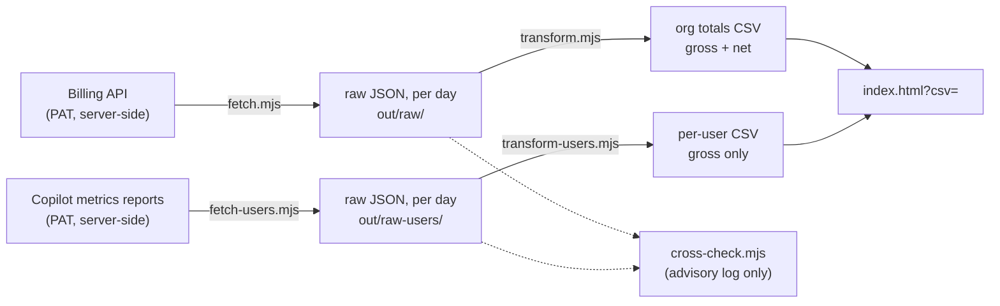

# Companion recipes — build viewer CSVs from the API

GitHub's **AI usage** page (under Billing) shows an organization's AI credit usage, but only
billing admins can open it. Its "Get usage report" button exports a CSV with a per-member
breakdown — a manual, admin-only download, not something to re-share on a schedule or with a
wide audience.

These dependency-free Node scripts rebuild that data from the API and write CSVs the viewer
opens. There are two recipes, and they answer different questions:

- **Organization totals** (`fetch.mjs` + `transform.mjs`) — what the org spent and what it is
  billed, gross and net. No per-member rows, so the result is safe to publish to non-admins.
- **Per-user consumption** (`fetch-users.mjs` + `transform-users.mjs`) — how much each member
  consumed, day by day. Gross only, and it names real people.

A scheduled job keeps either one current without anyone re-exporting by hand.

Every script takes the period to acquire or publish as an explicit, required inclusive UTC
range — `FROM_DAY=2026-06-01 THROUGH_DAY=2026-06-02`, for example. None of them work a period
out for themselves: the caller (a workflow, or you running a script by hand) always states the
range, which is what lets the same scripts serve both a live current-month site and a later
historical backfill without changing their contract.


```mermaid
flowchart LR
    BILL["Billing API<br/>(PAT, server-side)"] -- fetch.mjs --> BRAW["raw JSON, per day<br/>out/raw/"]
    BRAW -- transform.mjs --> BCSV["org totals CSV<br/>gross + net"]
    MET["Copilot metrics reports<br/>(PAT, server-side)"] -- fetch-users.mjs --> URAW["raw JSON, per day<br/>out/raw-users/"]
    URAW -- transform-users.mjs --> UCSV["per-user CSV<br/>gross only"]
    BRAW -.-> CHECK["cross-check.mjs<br/>(advisory log only)"]
    URAW -.-> CHECK
    BCSV --> VIEW["index.html?csv="]
    UCSV --> VIEW
```

Both recipes split the same way: the fetch script saves the API response as raw per-day JSON
and the transform script turns that into a CSV. Re-running a transform never calls the API.

## Organization totals

- **`fetch.mjs`** — read the organization's daily AI credit usage and save the raw JSON.
  Never prints the token or response body; only `YYYY-MM-DD: 200 OK (N items)`.
  - env: `AI_USAGE_PAT`, `ORG`, `FROM_DAY`, `THROUGH_DAY` (required); `RAW_DIR`.
  - range: `FROM_DAY`..`THROUGH_DAY` inclusive, one API call per day. A day the run is
    still on (typically the current UTC day) is partial, since the API reports it as it
    accumulates. Every requested day is required — a failed or missing day fails the whole
    run rather than saving a partial range. Output: `RAW_DIR/*.json` (default `./out/raw`).
- **`transform.mjs`** — convert the raw JSON into one CSV with the **same schema as the
  manual GitHub export** (minus the deprecated `aic_*` columns). No token needed.
  - env: `RAW_DIR` (default `./out/raw`), `FROM_DAY`, `THROUGH_DAY` (required, the same
    range given to `fetch.mjs`), `OUT_CSV`. `organization` comes from the JSON; `username`
    is a constant `(org total)` (the API has no per-user dimension); amounts are written at
    full precision so totals match the API exactly.
  - scope: only raw files named for a day inside `FROM_DAY`..`THROUGH_DAY` are read, so a file
    left over from a different acquisition period in a reused `RAW_DIR` cannot leak into the
    output. Every day of the range must be present, and a file whose own `timePeriod` names a
    day outside the range is a fatal mismatch rather than a silently dropped day. A requested
    range with zero usage items is always a fatal error too; there is no normal empty-Overview
    result.

```bash
cd automation
# .env (gitignored): AI_USAGE_PAT=...  ORG=...
FROM_DAY=2026-06-01 THROUGH_DAY=2026-06-02 node --env-file=.env scripts/fetch.mjs   # -> out/raw/*.json
FROM_DAY=2026-06-01 THROUGH_DAY=2026-06-02 node scripts/transform.mjs               # -> out/ai-credit-usage.csv
```

The required token is a fine-grained PAT with **Organization Administration: read**.

## Per-user consumption

- **`fetch-users.mjs`** — read the Copilot usage metrics reports and save the raw rows as
  per-day JSON. Never prints the token or the rows; only `YYYY-MM-DD: N rows`.
  - env: `AI_USAGE_PAT`, `ORG`, `FROM_DAY`, `THROUGH_DAY` (required); `USERS_RAW_DIR`
    (default `./out/raw-users`).
  - range: one call to `copilot/metrics/reports/users-28-day/latest` covers
    `report_start_day`..`report_end_day`; only the requested days that call actually covers
    are saved from it. Requested days before `report_start_day` are required to complete the
    range, so each is fetched one at a time from `copilot/metrics/reports/users-1-day`. A `204`
    there is a day the reports carry no rows for, saved as the empty day it is. A non-2xx status
    or a network error fails the whole run rather than saving a partial month — a day past the
    reports' one-year retention answers `400`, and so counts as one. Requested days after
    `report_end_day` are simply not generated yet: this script never fetches or synthesizes them.
  - a `204` from the 28-day report — or a report whose `report_end_day` is older than the
    requested `FROM_DAY` — means the range has nothing generated yet at all; the script logs
    that, clears the requested days, and exits 0 without treating it as an error.
  - the requested days are cleared from `USERS_RAW_DIR` and rewritten once the run knows what
    the report holds for them — every day in hand, or nothing generated yet — so a reused
    directory carries either this run's result or the previous one's, never a mix, and a
    "nothing yet" answer cannot leave last month's days behind to be published again. Days
    outside the range are left alone, and a run that stops on a technical failure — a bad
    token, a malformed report, a backfill day the API cannot serve — leaves the directory
    exactly as it found it.
- **`transform-users.mjs`** — convert those rows into one CSV with the same export schema, one
  row per member per day. No token needed.
  - env: `USERS_RAW_DIR` (default `./out/raw-users`), `ORG` (required, written to the
    `organization` column), `FROM_DAY`, `THROUGH_DAY` (required, the same range given to
    `fetch-users.mjs`), `OUT_CSV`.
  - scope: only raw files (and, defensively, only rows whose own `day` field) inside
    `FROM_DAY`..`THROUGH_DAY` are used. Members who used no credits produce no row.
  - publication contract: an existing `USERS_RAW_DIR` with no file in the requested range, or
    with rows but none carrying positive credits, is a normal "nothing to publish" result — the
    script exits 0, logs why, and removes a stale `OUT_CSV` left over from a reused output
    directory rather than leaving a previous run's file behind. Input that cannot be trusted is
    fatal: a `USERS_RAW_DIR` that cannot be read at all (`fetch-users.mjs` has not run), corrupt
    JSON, or a file that is not an array of row objects. A successful CSV is written atomically,
    so a crash mid-write can never replace a good file with a half-written one.

```bash
cd automation
FROM_DAY=2026-06-01 THROUGH_DAY=2026-06-02 node --env-file=.env scripts/fetch-users.mjs   # -> out/raw-users/*.json
FROM_DAY=2026-06-01 THROUGH_DAY=2026-06-02 ORG=your-org node scripts/transform-users.mjs  # -> out/ai-credit-usage-by-user.csv
```

The required token is a fine-grained PAT with the organization's
**View Organization Copilot Metrics** permission (a classic PAT with the `read:org` scope also
works) — a different permission from the billing recipe above, and the organization must have
the Copilot usage metrics policy enabled.

### What the per-user CSV carries

The metrics reports give one number per member per day: credits consumed. At $0.01 per credit
that is the same **gross** amount the billing API reports, so `quantity` and `gross_amount`
line up with the org totals CSV. Everything else the export schema has room for is left empty:

- **`net_amount` and `discount_amount` are blank.** Net is what the org is actually billed
  after the included AI credit pool is applied, and no API attributes that to a member. Blank
  means *not available* — it does not mean the usage was fully covered. Do not fill these in
  by prorating the org's discount.
- **`model` is `(all models)` and `sku` is `Copilot AI Credits`.** The credit figure already
  sums every model and SKU, and the reports carry no breakdown to split it by.
- **`total_monthly_quota`, `repository` and `cost_center_name` are blank** for the same reason.

The credit figure only exists from 2026-06-19, when GitHub
[added it to the reports](https://github.blog/changelog/2026-06-19-ai-credits-consumed-per-user-now-in-the-copilot-usage-metrics-api/).
It was not backfilled, so earlier days carry no credit field at all and produce no rows.

The reports lag a day or two behind, and the two feeds have independent timelines: their newest
day can differ, and their histories can start on different dates. Each CSV stands on its own —
neither is trimmed to match the other.

## Cross-checking the two feeds

**`cross-check.mjs`** is a standalone, advisory validator, separate from either transform: it
compares the two feeds' raw daily totals for an automation consumer's operator logs, and never
changes a CSV or the run's exit status.

- env: `RAW_DIR` (default `./out/raw`), `USERS_RAW_DIR` (default `./out/raw-users`),
  `FROM_DAY`, `THROUGH_DAY` (required, the same range given to the acquisition/transform
  scripts for the run).
- Only days both feeds actually cover within the requested range are compared; a day only one
  feed carries, or one whose file cannot be read, is skipped, and a difference over one AI
  credit (`$0.01`) is logged. On the billing side only usage items priced in `ai-credits` are
  summed, so the two sides are the same quantity. The whole check is skipped cleanly when this
  run has no Members data at all.

```bash
FROM_DAY=2026-06-01 THROUGH_DAY=2026-06-02 node scripts/cross-check.mjs
```

This is the automation side of feed reconciliation, for whoever runs the scheduled job. The
Viewer (`../index.html`) has its own, separate reader-facing validation banner, which checks
organization, overlap and daily Gross at the CSV level for whoever opens the page.

## Tests

`transform.mjs`, `transform-users.mjs`, and `cross-check.mjs` have tests in `tests/` (raw JSON
fixtures + the mapping); `fetch.mjs` and `fetch-users.mjs` have tests for the range they resolve
and, for `fetch-users.mjs`, the acquisition flow against a fake report server; and
`date-range.mjs` — the FROM_DAY/THROUGH_DAY validation every script shares — has its own
tests. Run them from the repo root with `npm run test:unit` (`node --test`, no token needed).
Calls to the live API itself are not unit-tested — check those paths by running the scripts
against your org.

## Viewer behavior (the two CSVs together)

The viewer (`../index.html`) is data-driven — it reads what a CSV carries and offers
only the tabs that CSV can answer, so both recipes just work with no special flag.

- The **org totals** CSV has a single distinct `username` and no per-member
  breakdown, so the viewer hides the Members tab, shows an Information note, and
  renders the Overview only: `?csv=…/ai-credit-usage.csv`.
- The **per-user** CSV has no `net_amount`, so there is no billed amount to report.
  The viewer hides the Overview, reports Net as not available rather than as fully
  covered, and renders Members only.
- Open both with `?csv=…&users_csv=…` and each tab reads the one that can answer it:
  Overview from the org totals, Members from the per-user rows. Which CSV drives
  which tab follows from its content, so the two parameters are interchangeable and
  dropping the files on the page works the same way.

## Getting the CSV to viewers

The **org totals** CSV has no per-user data (totals by date and model), so it is safe to share
widely. The **per-user** CSV names real members, so give it the audience you would give the
manual export — keep it inside the org, on a member-restricted host. Two ways to get a CSV in
front of people:

1. **Hand them the file** (any plan, no infra) — run the two scripts and share the CSV:
   drop it onto the viewer (`index.html`), or put it wherever your team looks. A scheduled
   GitHub Actions job can produce the CSV as a downloadable artifact instead of you running
   it by hand.
2. **Host a page they can open** — serve `index.html` + the CSV from the same origin and
   share `index.html?csv=./data.csv` (same-origin avoids CORS). Any static host works (S3,
   an internal server, GitHub Pages). On **GitHub Enterprise Cloud**, a member-restricted
   **private GitHub Pages** site lets non-admins with repo read access self-serve the
   always-current Overview. Keep the data repo private — `workflows/update-overview.yml` is
   a ready-to-copy template for exactly this.

## Deploying with the workflow (GitHub Pages)

`workflows/` carries two ready-to-copy templates, each a reference consumer of the scripts
above. Both compute the current UTC month's start and the current UTC date as
`FROM_DAY`/`THROUGH_DAY`, build the CSV(s), and deploy the viewer to GitHub Pages every hour, so
the newest day tracks the current UTC day as it accumulates. A new month is requested from its
1st, so the Overview covers that day as a partial as soon as the org has any usage on it — until
then the range holds no usage items, the run stops rather than publishing an empty Overview, and
the previous deployment stays live.

- **`update-overview.yml`** publishes the org totals alone — no member names, so the page is
  safe for any non-admin to open.
- **`update-overview-and-members.yml`** adds the per-user CSV, for a site the whole org may
  read. See "Publishing the per-user CSV too" below before choosing it.

On a plan with a small Actions allowance, `'17 */3 * * *'` (every three hours) costs a third as
much.

To use one, create a **private** repository — putting it in the target org lets `ORG` default to
the repo owner — containing:

- `index.html` (the viewer)
- `automation/scripts/fetch.mjs`, `automation/scripts/transform.mjs`, and
  `automation/scripts/date-range.mjs`, plus the two `-users` scripts (and
  `cross-check.mjs`) if you picked the Overview-and-Members template
- the template you picked, copied into `.github/workflows/`

Then:

1. **Secret** — Settings → Secrets and variables → Actions → `AI_USAGE_PAT` = a fine-grained
   PAT with Organization Administration: read.
2. **Variable** (optional) — `ORG` = the org login. Skip it when the repo lives in the target
   org; set it only to target a different org.
3. **Pages** — Settings → Pages → Source = "GitHub Actions". Set visibility to Private to
   restrict access to members with repo read.
4. **Default branch** — Actions only runs a workflow from the repository's default branch, so
   push these files to it (e.g. `main`).
5. Trigger it from the Actions tab (or wait for the schedule), then share
   `<pages-url>/index.html?csv=./data/ai-credit-usage.csv`.

### Publishing the per-user CSV too

`workflows/update-overview-and-members.yml` builds both CSVs in one run. Copy it instead of
`update-overview.yml`, add the two `-users` scripts and `cross-check.mjs` to the repository, and
give the PAT the View Organization Copilot Metrics permission on top of the billing one. The job
summary links the viewer with `users_csv=` appended only for a run that actually published a
Members CSV:
`<pages-url>/index.html?csv=./data/ai-credit-usage.csv&users_csv=./data/ai-credit-usage-by-user.csv`.
Because that CSV names members, publish it only to a site the whole org may read.

Two things to expect from the metrics feed:

- A day's report is not served until several hours into the next UTC day, so Members catches up
  over the course of that day rather than at a fixed time. A schedule that only ran near the UTC
  rollover would never reach it.
- Until the current month has been generated at all, or until it has its first positive-credit
  day, `fetch-users.mjs` and `transform-users.mjs` both exit successfully with no Members CSV —
  this is the normal state for a new month, not a failure, so the run still publishes the
  Overview. Only a technical failure (a bad token, a corrupt download, or a required backfill
  day the API cannot produce) fails the job and preserves the previous deployment.

## Privacy

Never commit real exports or tokens (`out/` and `.env` are gitignored). The token lives
only in CI secrets or a local `.env` and is never embedded in the viewer. For
member-restricted hosting, use a private repo. `out/raw-users/` holds the metrics rows as the
API returned them — member logins alongside activity fields the CSV does not use — so treat
that directory like the export itself.
